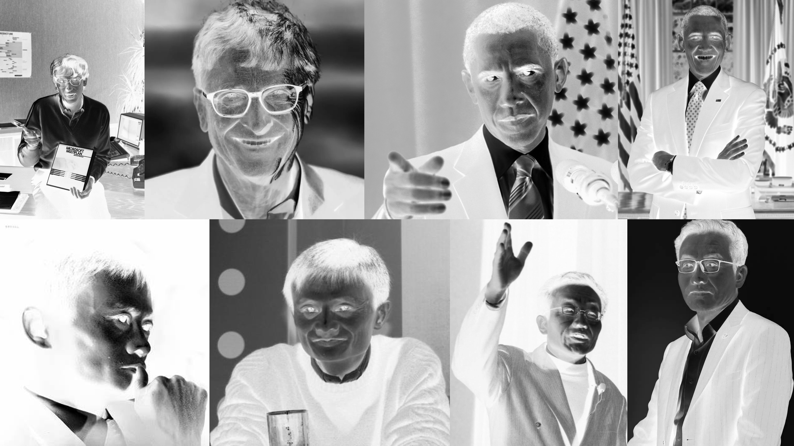
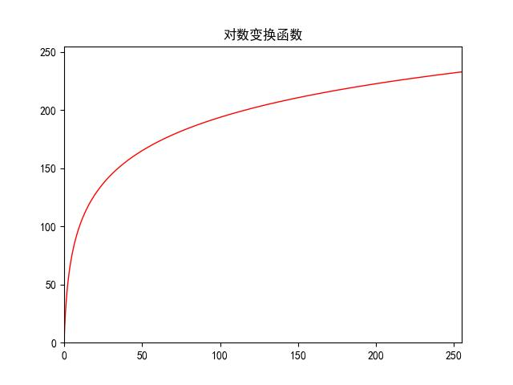
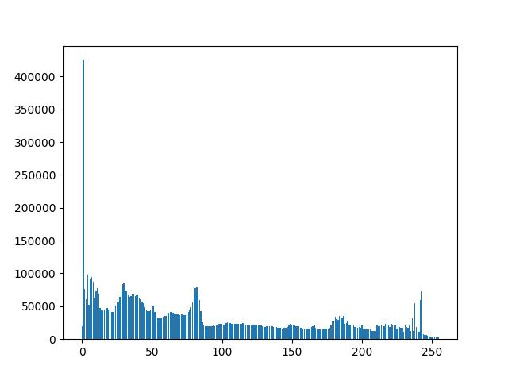
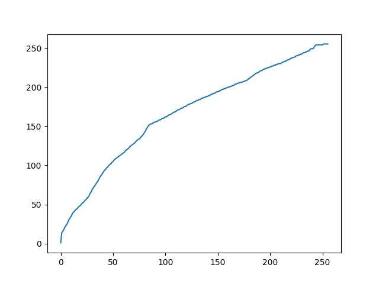

## Task1：自己找一张灰度图，实现图像反转、对数变换和伽马变换。
>要求：编写python代码实现，提交报告（代码+结果）

**原图：**


### 图像反转
**代码**

使用PIL
```python
from PIL import Image
import torchvision.transforms as transforms
#图像反转 
image = Image.open("image/imgGray.jpg").convert("L") #读入原始图像
image = transforms.ToTensor()(image)
img = transforms.ToPILImage()(1-image)
img.show()
img.save("image/imgGrayTran.jpg")
```
使用CV2
```python
import cv2
import copy

gray = cv2.imread('image\\imgGray.jpg',1) #读入原始图像
cover=copy.deepcopy(gray)
#图像反转
rows=gray.shape[0]
cols=gray.shape[1]
for i in range(rows):
    for j in range(cols):
        cover[i][j]=255-cover[i][j]

cv2.imshow('gray',gray)
cv2.imshow('cover',cover)
cv2.imwrite('image\\imgGrayTran.jpg',cover)
cv2.waitKey(0)
```

**图像**


### 对数变换
**代码**
```python
import numpy as np
import matplotlib.pyplot as plt
import cv2

#绘制曲线
def log_plot(c):
    x = np.arange(0, 256, 0.01)
    y = c * np.log(1 + x)
    plt.plot(x, y, 'r', linewidth=1)
    plt.rcParams['font.sans-serif']=['SimHei'] #设置字体以正常显示
    plt.title(u'对数变换函数')
    plt.xlim(0, 255), plt.ylim(0, 255)
    plt.savefig('image/对数变换函数.jpg')
    plt.show()

#对数变换
def log(c, img):
    output = c * np.log(1.0 + img)
    output = np.uint8(output + 0.5)
    return output

img = cv2.imread('image\\imgGray.jpg') #读取原始图像
log_plot(42)#绘制对数变换曲线
output = log(42, img)#图像灰度对数变换

cv2.imshow('Input', img)
cv2.imshow('Output', output)
cv2.imwrite('image\\Log_transImage.jpg',output)
cv2.waitKey(0)
cv2.destroyAllWindows()
```
**图像**

*对数变换函数：*



*得到的图片：*


### 伽马变换
**代码**
```python
import cv2
import copy

gray = cv2.imread('image\\imgGray.jpg',1) #读入原始图像
gamma=copy.deepcopy(gray)

#伽马变换
rows=gray.shape[0]
cols=gray.shape[1]
for i in range(rows):
    for j in range(cols):
        gamma[i][j]=3*pow(gamma[i][j],0.8)

cv2.imshow('img',gray)
cv2.imshow('gamma',gamma)
cv2.imwrite('image\\imgGrayGamma.jpg',gamma)
cv2.waitKey(0)
```
**图像**


## Task2：自己找一张灰度图，实现直方图均衡化。
> 要求：编写python实现均衡化代码，提交报告（代码+结果）

**代码**
```python
import cv2
import numpy as np
import matplotlib.pyplot as plt
import collections


# 计算灰度图的直方图
def draw_histogram(grayscale):
    gray_key = []
    gray_count = []
    gray_result = []
    histogram_gray = list(grayscale.ravel())  # 将多维数组转换成一维数组
    gray = dict(collections.Counter(histogram_gray))  # 统计图像中每个灰度级出现的次数
    gray = sorted(gray.items(), key=lambda item: item[0])  # 根据灰度级大小排序
    for element in gray:
        key = list(element)[0]
        count = list(element)[1]
        gray_key.append(key)
        gray_count.append(count)
    for i in range(0, 256):
        if i in gray_key:
            num = gray_key.index(i)
            gray_result.append(gray_count[num])
        else:
            gray_result.append(0)
    gray_result = np.array(gray_result)
    return gray_result


def histogram_equalization(histogram_e, lut_e, image_e):
    sum_temp = 0
    cf = []
    for i in histogram_e:
        sum_temp += i
        cf.append(sum_temp)
    for i, v in enumerate(lut_e):
        lut_e[i] = int(255.0 * (cf[i] / sum_temp) + 0.5)
    equalization_result = lut_e[image_e]
    return equalization_result


x = []
for i in range(0, 256):  # 横坐标
    x.append(i)

image = cv2.imread(r'image\\imgGray.jpg', cv2.COLOR_BGR2GRAY)  # 读取图像
histogram = draw_histogram(image)  # 直方图转化
plt.bar(x, histogram)  # 绘制原图直方图
plt.savefig('image/原图直方图.jpg')
plt.show()

lut = np.zeros(256, dtype=image.dtype)  # 创建空的查找表,返回image类型的用0填充的数组；
result = histogram_equalization(histogram, lut, image)  # 均衡化处理
cv2.imwrite('image\\equalImage.jpg', result)  # 保存均衡化后图片


plt.plot(x, lut)  # 绘制灰度级变换曲线图
plt.savefig('image\\灰度级变换曲线图.jpg')
plt.show()

cv2.imshow('former', image)
cv2.imshow("histogram_equalization", result)
cv2.waitKey(0)
cv2.destroyAllWindows()
```
**图像**

*原图直方图*



*均衡化后图片*


*灰度级变换曲线图*

